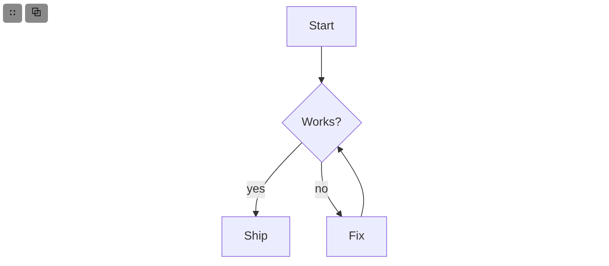
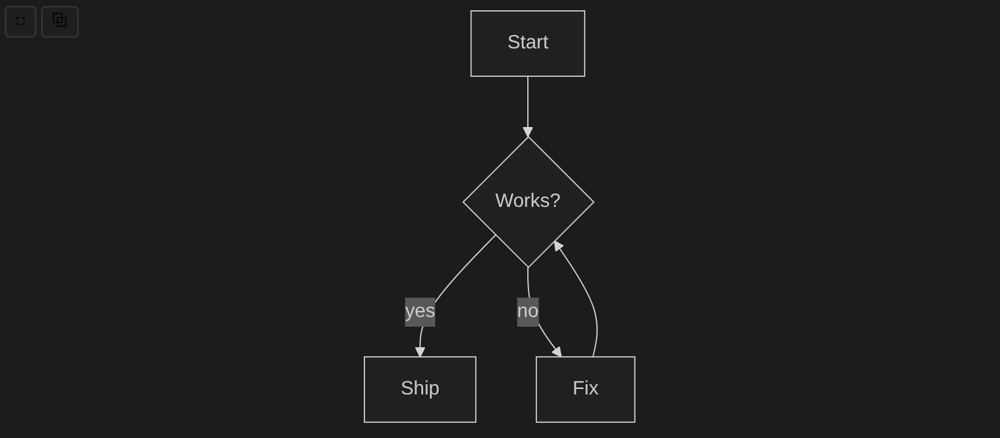
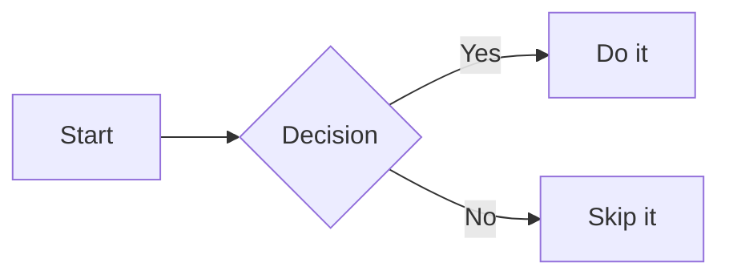

# Diagram Blocks

A [Logseq](https://logseq.com/) plugin that renders **Mermaid** fenced code blocks as interactive diagrams — theme-synced, fullscreen pan/zoom, and copy-as-PNG.

| Light mode | Dark mode |
| --- | --- |
|  |  |

*The same block, automatically restyled when Logseq's theme changes. The toolbar (top left) opens the fullscreen pan/zoom overlay or copies the diagram as a PNG.*

## What it does

Write a `mermaid` fenced code block in any Logseq page or journal entry and the plugin replaces the raw text with a live SVG diagram. The diagram automatically matches Logseq's light/dark mode (or you can pin a specific Mermaid theme in the plugin settings). A small toolbar lets you open the diagram in a fullscreen pan/zoom overlay or copy it to the clipboard as a PNG.

Supported Mermaid diagram types include flowcharts, sequence diagrams, class diagrams, Gantt charts, state diagrams, entity-relationship diagrams, pie charts, and more — the full Mermaid 11 vocabulary.

## Installation

**Marketplace (coming soon):** the plugin will be listed in the Logseq marketplace once it passes review.

**Load unpacked (now):**

1. Download the latest release `.zip` from the [Releases](../../releases) page and unzip it, **or** clone this repo and run `pnpm install && pnpm build`.
2. In Logseq, open **Settings → Plugins → Load unpacked plugin** and select the extracted folder (release zip) or the repo root (dev build).
3. Reload Logseq. Mermaid blocks will render automatically.

## Usage

In any Logseq block, write a fenced code block with the `mermaid` language tag:

````

````

The block is rendered as an SVG diagram in place. Hover over the diagram to reveal the toolbar:

| Button | Action |
|--------|--------|
| ⛶ | Open fullscreen pan/zoom overlay |
| ⧉ | Copy diagram to clipboard as PNG |

In the fullscreen overlay, drag to pan and scroll/pinch to zoom. Press **Escape** or click the backdrop to close.

## Settings

| Setting | Type | Default | Description |
|---------|------|---------|-------------|
| `theme` | enum | `auto` | Mermaid diagram theme. `auto` follows Logseq's light/dark mode; other choices: `default`, `dark`, `forest`, `neutral`, `base`. |
| `pngScale` | number | `2` | Resolution multiplier used when copying a diagram as PNG. `2` produces a 2× (retina) image. |

Theme changes apply to all visible diagrams immediately; `pngScale` applies to the next copy. There is no need to reload Logseq.

## Limitations

- **PNG copy fallback:** If PNG serialization fails unexpectedly (e.g. a clipboard restriction in the host environment), the copy button falls back to writing the SVG source as text and says so. With current Chromium-based Logseq this should be rare — HTML-label (`foreignObject`) diagrams copy as PNG normally.
- **Mermaid only:** This version renders Mermaid diagrams. PlantUML and Kroki support are planned for v2.

## Roadmap

- **v2:** PlantUML / Kroki rendering via a configurable server endpoint.

## Credits

- Inspired by [logseq-fenced-code-plus](https://github.com/xyhp915/logseq-fenced-code-plus) as prior art for the fenced-code renderer approach.
- Diagram rendering powered by [Mermaid](https://mermaid.js.org/).

## License

MIT — see [LICENSE](LICENSE) for details.
